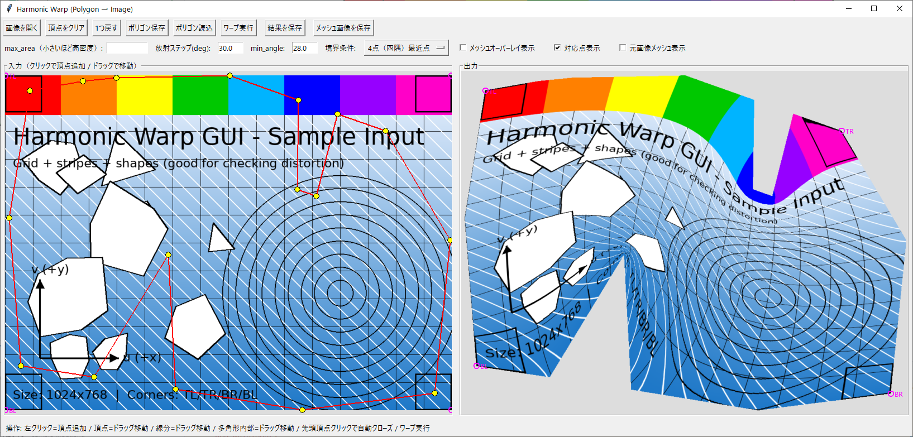

# Harmonic Warp GUI

`warp_image_gui.py` は、GUI上で指定した多角形領域に対して、入力画像（長方形）を **メッシュ化 + 調和写像（cotangent Laplacian） + 三角形ラスタライズ（逆写像）** によりワープして貼り付けるツールです。

## Screenshots
### Example GUI view



## 特徴

- Tkinter GUI で多角形の頂点を指定・編集
- 境界条件（複数モード）に対応
- ワープ結果の保存
- メッシュ・対応点の可視化（ON/OFF）
- 多角形座標の保存・読込（JSON / テキスト）

## 動作環境

- Python 3.9+ 推奨（3.10/3.11でも可）
- OS: Windows / macOS / Linux

## 依存ライブラリ

- numpy
- pillow
- scipy
- triangle（※PyPIではなく GitHub から導入）

## セットアップ

### 1) 仮想環境（推奨）

#### Windows (PowerShell)
```powershell
python -m venv .venv
.venv\Scripts\Activate.ps1
```

#### macOS / Linux
```bash
python3 -m venv .venv
source .venv/bin/activate
```

### 2) 依存のインストール

```bash
pip install -r requirements.txt
```

> `triangle` は以下の GitHub リポジトリから導入します（requirements.txt に反映済み）  
> `pip install git+https://github.com/drufat/triangle`

## 実行方法

```bash
python warp_image_gui.py
```

---

## 使い方（概要）

1. 画像を開く
2. 多角形を編集（追加/削除/挿入/ドラッグ移動 等）
3. 「ワープ実行」
   - 未確定の場合は自動的に閉じて多角形確定します
4. 結果保存 / メッシュ保存 / ポリゴン座標の保存・読込

---

## 境界条件モードの説明

境界条件は「入力画像の境界（矩形）上の点」と「貼り付け先多角形境界上の点」を対応させ、境界上の UV を固定するための設定です。

### 1) 原点(0,0) 最近点
- 入力矩形の `(u,v)=(0,0)`（左上）を、多角形境界上で **(0,0) に最も近い点**に対応させます。
- その点を境界パラメータの起点として扱います。
- 目的：起点合わせを簡単に行いたい場合。

### 2) 4点（四隅）最近点
- 入力矩形の四隅 `TL/TR/BR/BL` を、多角形境界上のそれぞれの「最近点」に対応させます。
- 4点間は境界上の順序に従って区分線形に補間し、境界全体の UV を固定します。
- 目的：回転/反転を抑えつつ、全体の歪みを比較的安定させたい場合。

### 3) 8点（四隅＋辺中点）最近点
- 四隅 + 各辺の中点（Top/Right/Bottom/Left mid）の計8点を、多角形境界上の最近点に対応。
- 4点より拘束が強く、境界形状に追従しやすい一方、形状によっては局所的に歪みが増える場合があります。
- 目的：境界の対応をより強く制御したい場合。

### 4) 放射（一定角度）交点対応（Rays）
- 多角形の中心から、一定角度刻みで半直線（ray）を引きます。
- 各 ray と **多角形境界との交点**を求め、交点が複数ある場合は **最も遠い交点**を採用します。
- 同じ角度の ray を入力画像側（矩形中心から）にも引き、矩形境界との交点を求めます。
- これらの交点同士を対応させ、境界上の UV を固定します。
- 目的：全周方向に均一な拘束を入れたい場合／凹形状で「最近点方式」より安定する可能性を試したい場合。

> 「対応点表示」機能を ON にすると、上記で用いた対応点（アンカー）を入力側／出力側に重ね表示できます。

---

## 推奨パラメータ

### 放射ステップ（deg）
放射モードでの角度刻みです。小さいほど対応点が増え、境界拘束が強くなります（ただし重くなります）。

- まず試す：`30°`
- もう少し滑らかに：`15°`
- 高品質（重い）：`10°` 〜 `5°`

目安：
- 30° → 12本
- 15° → 24本
- 10° → 36本
- 5°  → 72本（重くなりやすい）

### メッシュ密度（max_area）
`triangle` の最大三角形面積（小さいほど細かいメッシュで高品質・高負荷）

経験則（目安）：
- 出力画像が大きいほど、自動推定でも三角形数が増えて重くなります。
- `max_area` を小さくし過ぎると、調和写像の解法・ラスタライズが重くなります。

### min_angle
三角形の最小角度（品質制約）。一般に大きいほど細長い三角形が減りますが、制約が強すぎると分割が難しくなる場合があります。

- 推奨：`28`（デフォルト）
- 問題が出る場合：`20`〜`30` の範囲で調整

---

## ポリゴン保存形式（JSON）

「ポリゴン保存」で出力される JSON は次のキーを持ちます。

- `format` : 形式識別子（将来互換用）
- `version`: バージョン番号（将来互換用）
- `image_size`: 保存時の画像サイズ
  - `{"w": <int>, "h": <int>}`
- `closed`: 多角形が閉じているか（bool）
- `vertices`: 頂点列（画像座標系）
  - `[[x0, y0], [x1, y1], ...]`

例：
```json
{
  "format": "warp_image_gui_polygon",
  "version": 1,
  "image_size": { "w": 1920, "h": 1080 },
  "closed": true,
  "vertices": [
    [100.0, 120.0],
    [820.0, 90.0],
    [900.0, 420.0],
    [540.0, 600.0]
  ]
}
```

### 読込時の挙動
- 画像が未読込の場合：警告して読み込みを中断します。
- 保存時 `image_size` と現在の画像サイズが異なる場合：  
  `sx = W_now / W_saved`, `sy = H_now / H_saved` で **自動スケーリング**して頂点を適用します。
- 読込後はワープ結果やメッシュ表示はクリアされます（再実行が必要）。

---

## 出力物

- ワープ結果画像（PNG）
- メッシュ可視化画像（PNG）
- 多角形座標ファイル（JSON/テキスト）

---

## 既知の注意点

- 多角形は「自己交差なし（単純多角形）」を前提とします。
- メッシュ密度を上げると品質は上がりますが計算が重くなります。

---

## ライセンス

このリポジトリの `LICENSE` を参照してください。
